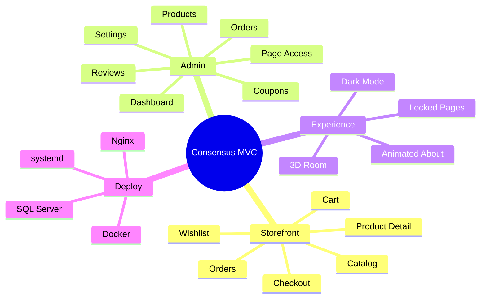
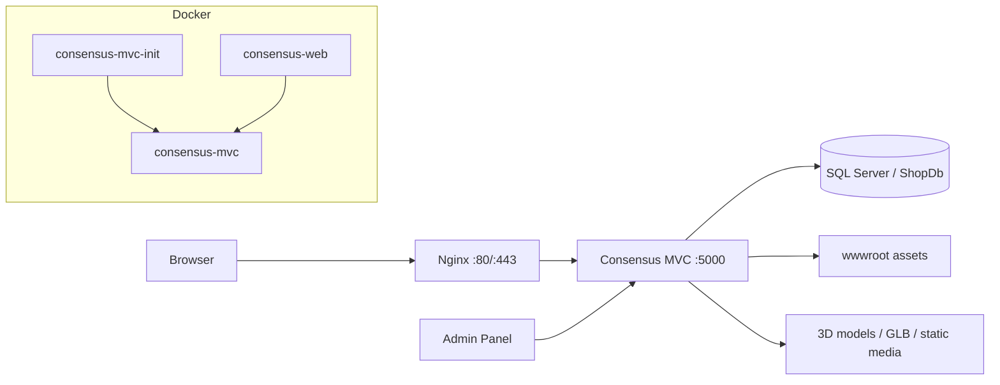

<p align="center">
  
</p>

<p align="center">
  
</p>

<p align="center">
  
  
  
  
  
</p>

<p align="center">
  
</p>

<p align="center">
  <b>Consensus</b> là một website thương mại điện tử nội thất với catalog, cart, checkout, admin dashboard, dark mode và phòng 3D tương tác.  
  Dự án được đóng gói cho cả Docker deployment và native Ubuntu deployment bằng systemd + Nginx.
</p>

<p align="center">
  <a href="#quick-start">Quick Start</a>
  ·
  <a href="#feature-showcase">Feature Showcase</a>
  ·
  <a href="#deployment-map">Deployment Map</a>
  ·
  <a href="#sql-playbook">SQL Playbook</a>
  ·
  <a href="#production-notes">Production Notes</a>
</p>

---

## Control Surface

<table>
  <tr>
    <td width="50%">
      <h3>Storefront</h3>
      <p>Trang chủ, catalog, category, product detail, wishlist, cart, checkout và order history. Luồng mua hàng được giữ rõ ràng để người dùng không phải đoán bước tiếp theo.</p>
    </td>
    <td width="50%">
      <h3>Admin Console</h3>
      <p>Quản lý sản phẩm, đơn hàng, coupon, review, tài khoản, website settings, maintenance mode và Page Access cho từng khu vực của storefront.</p>
    </td>
  </tr>
  <tr>
    <td width="50%">
      <h3>3D Room</h3>
      <p>Không gian nội thất tương tác để đặt thử sản phẩm, quan sát decor, thêm vào giỏ hàng và tạo cảm giác demo sống hơn một catalog phẳng.</p>
    </td>
    <td width="50%">
      <h3>Deployment</h3>
      <p>Docker multi-stage, SQL Server compose, one-shot SQL init, Nginx reverse proxy và systemd service cho Ubuntu native runtime.</p>
    </td>
  </tr>
</table>

<p align="center">
  
</p>

## Feature Showcase



### Page Access bí ẩn

Admin có thể khóa từng trang nhưng vẫn để link hiện trên menu. Người dùng bấm vào sẽ gặp màn hình khóa với thông điệp do admin cấu hình.

```text
Menu vẫn hiện
      |
      v
User click vào trang đang khóa
      |
      v
Middleware kiểm tra WebSettings
      |
      v
Hiển thị locked page cinematic message
```

### 3D Room

- Đặt sản phẩm vào không gian phòng.
- Thêm item vào cart từ ngữ cảnh 3D.
- Decor và model được load từ `wwwroot/models`.
- Có thể bật/tắt access bằng admin settings.

### Admin Settings

- Logo, favicon, màu, SEO, homepage copy.
- Payment settings cho COD, VNPay, MoMo, bank transfer.
- Maintenance, popup, announcement, newsletter.
- Page Access: bật/tắt trang, ẩn/hiện link locked page, chỉnh text locked page.

## Architecture



## Quick Start

### Docker mode

```bash
docker compose up -d --build
```

```text
App:        http://localhost:5000
SQL Server: localhost:1433
Web:        consensus-web
Database:   consensus-mvc
Init:       consensus-mvc-init
```

The app container reads project root `.env` through `env_file`.

### Native Ubuntu mode

```bash
docker compose up -d mssql mssql-init
bash deploy/ubuntu/deploy.sh
```

Native mode runs the app with systemd:

```bash
sudo systemctl status consensus
sudo systemctl restart consensus
sudo journalctl -u consensus -f
```

Nginx proxies to:

```text
http://127.0.0.1:5000
```

## Deployment Map

| Mode | App runtime | Database | Env source | Reverse proxy |
| --- | --- | --- | --- | --- |
| Docker | `consensus-web` container | `consensus-mvc` container | `.env` via compose `env_file` | Nginx to `127.0.0.1:5000` |
| Ubuntu native | systemd `consensus.service` | Docker SQL or external SQL | `/etc/consensus/consensus.env` | Nginx to `127.0.0.1:5000` |

### Docker compose services

| Service | Container | Purpose |
| --- | --- | --- |
| `web` | `consensus-web` | ASP.NET Core MVC app |
| `mssql` | `consensus-mvc` | SQL Server 2022 |
| `mssql-init` | `consensus-mvc-init` | One-shot seed runner for `furnish_all_in_one.sql` |

## SQL Playbook

| File | Purpose |
| --- | --- |
| `furnish_all_in_one.sql` | Fresh demo setup: database, schema, seed data, admin/customer, page access settings |
| `furnish_update_existing_db.sql` | Patch existing DB without full reseed |
| `furnish_update_page_access_settings.sql` | Add/update only Page Access settings |
| `furnish_schema.sql` | Base schema |
| `furnish_seed.sql` | Demo data seed |

Manual all-in-one run:

```bash
docker exec -it consensus-mvc /opt/mssql-tools18/bin/sqlcmd \
  -S localhost \
  -U sa \
  -P "Strong123!" \
  -C \
  -i /tmp/furnish_all_in_one.sql
```

> `furnish_all_in_one.sql` is a fresh/demo script. It can recreate `ShopDb`. Do not run it on production data unless you intend to reset the database.

## Environment Keys

```text
DB_CONNECTION_STRING
EMAIL_SMTP_HOST
EMAIL_SMTP_PORT
EMAIL_SMTP_USER
EMAIL_SMTP_PASSWORD
EMAIL_FROM
EMAIL_FROM_NAME
VNPAY_TMNCODE
VNPAY_HASH_SECRET
VNPAY_CALLBACK_URL
MOMO_PARTNER_CODE
MOMO_ACCESS_KEY
MOMO_SECRET_KEY
MOMO_RETURN_URL
ADMIN_SECRET_CODE
```

## Admin Access

Seed account:

```text
Username: admin
Password: admin123
```

High-value admin screens:

```text
Dashboard  -> revenue, orders, products, system overview
Products   -> item info, variants, images, stock status
Orders     -> payment, fulfillment, cancel/return flow
Settings   -> branding, payment, SEO, maintenance, Page Access
```

## Build Checks

```bash
dotnet build
dotnet publish WebActionResults.csproj -c Release
docker compose config
```

## Production Notes

- Change SQL Server password before public deployment.
- Put real secrets in `.env` or `/etc/consensus/consensus.env`.
- Configure HTTPS through Nginx and Certbot.
- Set the real public domain for verification/payment callback URLs.
- Use patch scripts for existing production data instead of re-running all-in-one.

<details>
<summary><b>Suggested Ubuntu flow</b></summary>

```bash
sudo apt update
sudo apt install -y nginx
docker compose up -d mssql mssql-init
bash deploy/ubuntu/deploy.sh
sudo nginx -t
sudo systemctl reload nginx
```

</details>

<details>
<summary><b>Suggested Docker flow</b></summary>

```bash
docker compose up -d --build
docker compose ps
docker logs consensus-web --tail 100
```

</details>

<p align="center">
  
</p>
