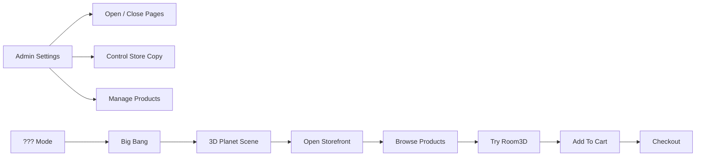
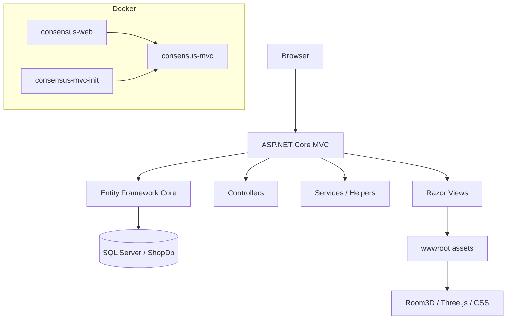

<h1 align="center">CONSENSUS</h1>

<p align="center">
  <b>Furniture commerce, 3D room, admin control, and one suspicious scene mode.</b>
</p>

<p align="center">
  <b>English</b>
  ·
  <a href="README.vi.md">Tiếng Việt</a>
</p>

<p align="center">
  
</p>

<p align="center">
  
  
  
  
  
  
</p>

<p align="center">
  <a href="#overview">Overview</a>
  ·
  <a href="#experience">Experience</a>
  ·
  <a href="#run">Run</a>
  ·
  <a href="#database">Database</a>
  ·
  <a href="#deploy">Deploy</a>
</p>

---

<a id="overview"></a>

## Overview

Consensus is a furniture e-commerce website built with ASP.NET Core MVC. It has the real store backbone: catalog, product detail, cart, checkout, orders, wishlist, profile, admin dashboard, website settings, and complete demo database seed scripts.

It does not stop at CRUD. The project includes an interactive Room3D experience, admin-controlled page access, VI/EN localization, light/dark themes, and a `???` mode powered by Three.js that turns the site into a small cosmic scene before revealing the interface.

```text
CONSENSUS
├─ Storefront       catalog, category, cart, checkout, orders
├─ Admin            products, orders, reviews, coupons, settings
├─ Room3D           interactive furniture placement
├─ Page Access      admin-controlled open / close / hidden menu
├─ Theme            light, dark, ???
└─ Deploy           Docker, SQL Server, Ubuntu, Nginx, systemd
```

---

<a id="experience"></a>

## Experience

| Surface | What happens |
| --- | --- |
| Storefront | Users browse products, filter the catalog, inspect details, add items to cart, and checkout. |
| Room3D | Users enter a 3D room, place furniture, inspect decor, and add products to cart from the room context. |
| Admin | Admin manages products, orders, reviews, coupons, accounts, branding, payment, and page access. |
| Page Lock | Admin can close pages, schedule opening time, hide links, or leave links visible for a mysterious click. |
| `???` Mode | Big bang intro, 3D planet scene, cosmos background, and gradual web reveal. It runs on the client so the server does not carry the visual work. |



<details>
<summary><b>Room3D notes</b></summary>

- Main logic: `wwwroot/js/room3d.js`
- Styles: `wwwroot/css/room3d.css`
- Decor and demo assets live under `wwwroot/models`
- Missing models have fallbacks so the room can still render during demo
- Items can be added to cart from the 3D room context

</details>

<details>
<summary><b>Page Access notes</b></summary>

Admin settings can control page availability:

```text
HideClosedPageLinks
PageHomeEnabled
PageShopEnabled
PageRoom3DEnabled
PageCategoriesEnabled
PageCartEnabled
PageOrdersEnabled
PageWishlistEnabled
PageAboutEnabled
PageRoom3DOpenAt
```

Middleware checks these settings before serving restricted pages.

</details>

<details>
<summary><b>??? mode notes</b></summary>

The special scene mode is intentionally client-side:

```text
Select ??? mode
    -> load Three.js only when needed
    -> play big bang intro
    -> hold 3D planet scene
    -> reveal web UI gradually
    -> dispose renderer/materials when mode is off
```

Main files:

```text
wwwroot/js/cosmos-mode.js
wwwroot/css/cosmos-mode.css
```

</details>

---

<a id="run"></a>

## Run

### Docker

```bash
docker compose up -d --build
```

```text
App:        http://localhost:5000
SQL Server: localhost:1433
Web:        consensus-web
Database:   consensus-mvc
Init:       consensus-mvc-init
```

The MVC app listens inside the container on `8080`.
Docker maps it to host port `5000`.

```text
host:5000 -> container:8080
```

### Local .NET

```bash
dotnet restore
dotnet build
dotnet run
```

Create `.env` from `.env.example` and set real values for database, mail, and payment callbacks.

---

## Architecture



```text
Areas/Admin        Admin dashboard and management screens
Controllers        Storefront, cart, checkout, payment, account, Room3D
Data               EF Core context and data services
Middleware         Page access enforcement
Resources          VI/EN localization
Views              Razor pages and shared layout
wwwroot            CSS, JS, media, 3D assets
deploy/ubuntu      systemd and Nginx deployment
```

---

<a id="database"></a>

## Database

| File | Purpose |
| --- | --- |
| `furnish_all_in_one.sql` | Fresh demo setup: database, schema, seed data, accounts, page access settings |
| `furnish_update_existing_db.sql` | Patch an existing database |
| `furnish_update_page_access_settings.sql` | Add or update page access settings only |
| `furnish_schema.sql` | Base schema |
| `furnish_seed.sql` | Demo seed data |

Manual all-in-one run:

```bash
docker exec -it consensus-mvc /opt/mssql-tools18/bin/sqlcmd \
  -S localhost \
  -U sa \
  -P "Strong123!" \
  -C \
  -i /tmp/furnish_all_in_one.sql
```

`furnish_all_in_one.sql` is for fresh/demo setup. Do not run it against production data unless resetting the database is intentional.

---

## Admin

Seed account:

```text
Username: admin
Password: admin123
```

High-value screens:

```text
Dashboard     revenue, products, orders, overview
Products      product fields, variants, images, stock
Orders        fulfillment and payment state
Reviews       customer feedback moderation
Coupons       discount setup
Settings      logo, SEO, payment, popup, newsletter, page access
```

---

<a id="deploy"></a>

## Deploy

### Docker app + SQL Server

```bash
docker compose up -d --build
docker compose ps
docker logs consensus-web --tail 100
```

### Ubuntu native + systemd + Nginx

```bash
docker compose up -d mssql mssql-init
bash deploy/ubuntu/deploy.sh
sudo systemctl status consensus
sudo journalctl -u consensus -f
```

Nginx proxies to:

```text
http://127.0.0.1:5000
```

| File | Role |
| --- | --- |
| `deploy/ubuntu/deploy.sh` | Publishes and installs the app to `/var/www/consensus` |
| `deploy/ubuntu/consensus.service` | Runs Kestrel on `127.0.0.1:5000` |
| `deploy/ubuntu/nginx-consensus.conf` | Nginx reverse proxy |
| `deploy/ubuntu/consensus.env.example` | Production environment template |

---

## Environment

Main keys from `.env.example`:

```text
DB_CONNECTION_STRING
EMAIL_SMTP_HOST
EMAIL_SMTP_PORT
EMAIL_SMTP_USER
EMAIL_SMTP_PASSWORD
EMAIL_FROM
EMAIL_FROM_NAME
VNPAY_TMNCODE
VNPAY_HASH_SECRET
VNPAY_CALLBACK_URL
MOMO_PARTNER_CODE
MOMO_ACCESS_KEY
MOMO_SECRET_KEY
MOMO_RETURN_URL
ADMIN_SECRET_CODE
```

Docker reads `.env` through `env_file`.
Ubuntu native uses `/etc/consensus/consensus.env`; if that file does not exist, `deploy.sh` can copy the project root `.env`.

---

## Demo Script

```text
1. Open storefront
2. Toggle ??? mode
3. Browse catalog
4. Enter Room3D
5. Place an item
6. Add to cart
7. Checkout
8. Enter admin
9. Lock a page
10. Return to storefront and test the locked page
```

---

## Before Shipping

```bash
dotnet build
docker compose config
docker compose up -d --build
```

Production checklist:

```text
Change SQL Server password
Keep real .env out of git
Set real domain for email verification
Set real callback URLs for payments
Enable HTTPS through Nginx and Certbot
Use update scripts for real data
```

---

## Author

```text
Consensus Team
```

<p align="center">
  <sub>Built for a furniture store. Behaves like it has a secret basement.</sub>
</p>
