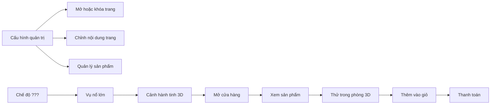
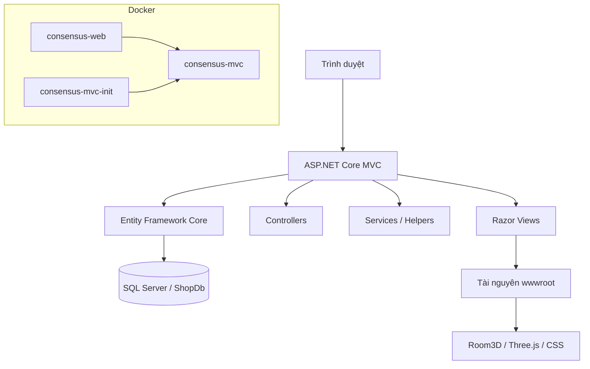

<h1 align="center">CONSENSUS</h1>

<p align="center">
  <b>Cửa hàng nội thất, phòng 3D, bảng quản trị và một chế độ bí ẩn hơi quá tay.</b>
</p>

<p align="center">
  <b>Tiếng Việt</b>
  ·
  <a href="README.md">English</a>
</p>

<p align="center">
  
</p>

<p align="center">
  
  
  
  
  
  
</p>

<p align="center">
  <a href="#tong-quan">Tổng quan</a>
  ·
  <a href="#trai-nghiem">Trải nghiệm</a>
  ·
  <a href="#chay-du-an">Chạy dự án</a>
  ·
  <a href="#du-lieu">Dữ liệu</a>
  ·
  <a href="#trien-khai">Triển khai</a>
</p>

---

<a id="tong-quan"></a>

## Tổng Quan

Consensus là trang thương mại điện tử nội thất được xây bằng ASP.NET Core MVC. Dự án có đầy đủ những luồng chính của một cửa hàng thật: xem danh mục, xem chi tiết sản phẩm, thêm vào giỏ, thanh toán, quản lý đơn hàng, yêu thích sản phẩm, hồ sơ người dùng, bảng quản trị, cấu hình trang và dữ liệu mẫu để trình diễn.

Điểm khác của Consensus là nó không chỉ dừng ở thêm, sửa, xóa dữ liệu. Trang có phòng 3D để đặt thử nội thất, cơ chế quản trị khóa/mở từng trang, giao diện song ngữ Việt/Anh, chế độ sáng/tối và chế độ `???` dùng Three.js để biến giao diện thành một cảnh vũ trụ trước khi đưa người dùng trở lại cửa hàng.

```text
CONSENSUS
├─ Cửa hàng          danh mục, sản phẩm, giỏ hàng, thanh toán, đơn hàng
├─ Quản trị          sản phẩm, đơn hàng, đánh giá, mã giảm giá, cấu hình
├─ Phòng 3D          đặt thử nội thất trong không gian tương tác
├─ Quyền truy cập    quản trị viên bật/tắt trang, ẩn menu, hẹn giờ mở trang
├─ Giao diện         sáng, tối, ???
└─ Triển khai        Docker, SQL Server, Ubuntu, Nginx, systemd
```

---

<a id="trai-nghiem"></a>

## Trải Nghiệm

| Khu vực | Người dùng nhận được gì |
| --- | --- |
| Cửa hàng | Xem sản phẩm, lọc danh mục, xem chi tiết, thêm vào giỏ và đi tới thanh toán. |
| Phòng 3D | Bước vào không gian 3D, đặt thử vật phẩm, xem đồ trang trí và thêm sản phẩm vào giỏ ngay trong phòng. |
| Quản trị | Quản lý sản phẩm, đơn hàng, đánh giá, mã giảm giá, tài khoản, nhận diện trang, thanh toán và quyền truy cập trang. |
| Khóa trang | Admin có thể khóa trang, hẹn giờ mở, ẩn liên kết hoặc để liên kết hiện theo kiểu bí ẩn cho người dùng tự khám phá. |
| Chế độ `???` | Mở đầu bằng vụ va chạm hành tinh, giữ cảnh vũ trụ 3D trong chốc lát rồi cho giao diện hiện lên từ từ. Hiệu ứng chạy trong trình duyệt nên máy chủ không phải gánh phần trình diễn. |



<details>
<summary><b>Ghi chú về phòng 3D</b></summary>

- Logic chính nằm ở `wwwroot/js/room3d.js`.
- Giao diện của phòng nằm ở `wwwroot/css/room3d.css`.
- Model trang trí và tài nguyên trình diễn nằm trong `wwwroot/models`.
- Nếu thiếu model, hệ thống có phương án dự phòng để phòng vẫn hiển thị được khi trình diễn.
- Một số vật phẩm trong phòng có thể gắn với sản phẩm thật và thêm vào giỏ.

</details>

<details>
<summary><b>Ghi chú về quyền truy cập trang</b></summary>

Admin có thể điều khiển việc mở, khóa hoặc ẩn các trang bằng những cấu hình sau:

```text
HideClosedPageLinks
PageHomeEnabled
PageShopEnabled
PageRoom3DEnabled
PageCategoriesEnabled
PageCartEnabled
PageOrdersEnabled
PageWishlistEnabled
PageAboutEnabled
PageRoom3DOpenAt
```

Lớp middleware sẽ đọc các cấu hình này trước khi cho phép người dùng vào những trang bị giới hạn.

</details>

<details>
<summary><b>Ghi chú về chế độ ???</b></summary>

Chế độ đặc biệt được thiết kế để chạy ở phía trình duyệt:

```text
Chọn chế độ ???
    -> chỉ tải Three.js khi cần
    -> chạy cảnh hai hành tinh va vào nhau
    -> giữ cảnh vũ trụ 3D trong một khoảng ngắn
    -> cho giao diện trang hiện lên dần
    -> tắt renderer/material khi thoát chế độ
```

Các file chính:

```text
wwwroot/js/cosmos-mode.js
wwwroot/css/cosmos-mode.css
```

</details>

---

<a id="chay-du-an"></a>

## Chạy Dự Án

### Chạy bằng Docker

```bash
docker compose up -d --build
```

```text
Ứng dụng:    http://localhost:5000
SQL Server:  localhost:1433
Dịch vụ web:   consensus-web
Cơ sở dữ liệu: consensus-mvc
Khởi tạo dữ liệu: consensus-mvc-init
```

Ứng dụng MVC lắng nghe ở cổng `8080` bên trong container. Docker ánh xạ cổng đó ra `5000` trên máy chạy Docker.

```text
máy chạy Docker:5000 -> container:8080
```

### Chạy bằng .NET trên máy cá nhân

```bash
dotnet restore
dotnet build
dotnet run
```

Tạo file `.env` từ `.env.example`, sau đó điền thông tin thật cho cơ sở dữ liệu, email và URL phản hồi của cổng thanh toán.

---

## Kiến Trúc



```text
Areas/Admin        khu vực quản trị và các màn hình quản lý
Controllers        cửa hàng, giỏ hàng, thanh toán, tài khoản, Room3D
Data               DbContext và các dịch vụ dữ liệu
Middleware         lớp kiểm tra quyền truy cập trang
Resources          tài nguyên song ngữ Việt/Anh
Views              Razor page và layout dùng chung
wwwroot            CSS, JS, media, model 3D
deploy/ubuntu      cấu hình triển khai bằng systemd và Nginx
```

---

<a id="du-lieu"></a>

## Dữ Liệu

| File | Công dụng |
| --- | --- |
| `furnish_all_in_one.sql` | Tạo mới cơ sở dữ liệu trình diễn: schema, dữ liệu mẫu, tài khoản, cấu hình quyền truy cập trang. |
| `furnish_update_existing_db.sql` | Cập nhật database đang có sẵn. |
| `furnish_update_page_access_settings.sql` | Chỉ thêm hoặc cập nhật phần cấu hình quyền truy cập trang. |
| `furnish_schema.sql` | Schema gốc. |
| `furnish_seed.sql` | Dữ liệu mẫu dùng cho trình diễn. |

Chạy file all-in-one thủ công:

```bash
docker exec -it consensus-mvc /opt/mssql-tools18/bin/sqlcmd \
  -S localhost \
  -U sa \
  -P "Strong123!" \
  -C \
  -i /tmp/furnish_all_in_one.sql
```

`furnish_all_in_one.sql` dành cho môi trường mới hoặc trình diễn. Không chạy file này lên dữ liệu thật nếu bạn không có ý định đặt lại cơ sở dữ liệu.

---

## Quản Trị

Tài khoản mẫu:

```text
Tên đăng nhập: admin
Mật khẩu:      admin123
```

Những màn hình quan trọng:

```text
Bảng điều khiển   doanh thu, sản phẩm, đơn hàng, tổng quan
Sản phẩm          thông tin sản phẩm, biến thể, ảnh, tồn kho
Đơn hàng          trạng thái xử lý và trạng thái thanh toán
Đánh giá          duyệt phản hồi của khách hàng
Mã giảm giá       thiết lập khuyến mãi
Cấu hình          logo, SEO, thanh toán, popup, bản tin, quyền truy cập trang
```

---

<a id="trien-khai"></a>

## Triển Khai

### Ứng dụng Docker + SQL Server

```bash
docker compose up -d --build
docker compose ps
docker logs consensus-web --tail 100
```

### Chạy trực tiếp trên Ubuntu + systemd + Nginx

```bash
docker compose up -d mssql mssql-init
bash deploy/ubuntu/deploy.sh
sudo systemctl status consensus
sudo journalctl -u consensus -f
```

Nginx proxy ngược về:

```text
http://127.0.0.1:5000
```

| File | Vai trò |
| --- | --- |
| `deploy/ubuntu/deploy.sh` | Build, publish và cài ứng dụng vào `/var/www/consensus`. |
| `deploy/ubuntu/consensus.service` | Chạy Kestrel tại `127.0.0.1:5000`. |
| `deploy/ubuntu/nginx-consensus.conf` | Cấu hình Nginx proxy ngược. |
| `deploy/ubuntu/consensus.env.example` | Mẫu biến môi trường cho môi trường thật. |

---

## Biến Môi Trường

Các key chính trong `.env.example`:

```text
DB_CONNECTION_STRING
EMAIL_SMTP_HOST
EMAIL_SMTP_PORT
EMAIL_SMTP_USER
EMAIL_SMTP_PASSWORD
EMAIL_FROM
EMAIL_FROM_NAME
VNPAY_TMNCODE
VNPAY_HASH_SECRET
VNPAY_CALLBACK_URL
MOMO_PARTNER_CODE
MOMO_ACCESS_KEY
MOMO_SECRET_KEY
MOMO_RETURN_URL
ADMIN_SECRET_CODE
```

Docker đọc `.env` thông qua `env_file`. Khi chạy trực tiếp trên Ubuntu, ứng dụng dùng `/etc/consensus/consensus.env`; nếu file này chưa tồn tại, `deploy.sh` có thể copy `.env` ở thư mục gốc dự án sang đúng vị trí.

---

## Kịch Bản Demo

```text
1. Mở trang chủ cửa hàng
2. Bật chế độ ???
3. Xem danh mục sản phẩm
4. Vào phòng 3D
5. Đặt thử một vật phẩm
6. Thêm sản phẩm vào giỏ
7. Đi tới thanh toán
8. Vào trang quản trị
9. Khóa thử một trang
10. Quay lại cửa hàng và kiểm tra giao diện trang bị khóa
```

---

## Trước Khi Triển Khai

```bash
dotnet build
docker compose config
docker compose up -d --build
```

Danh sách kiểm tra cho môi trường thật:

```text
Đổi mật khẩu SQL Server
Không commit file .env thật lên git
Cấu hình domain thật cho link xác thực email
Cấu hình URL phản hồi thật cho cổng thanh toán
Bật HTTPS qua Nginx và Certbot
Dùng script update khi thao tác với dữ liệu thật
```

---

## Tác Giả

```text
Nhóm Consensus
```

<p align="center">
  <sub>Làm cho cửa hàng nội thất, nhưng vẫn có cảm giác phía sau còn một tầng bí mật.</sub>
</p>
